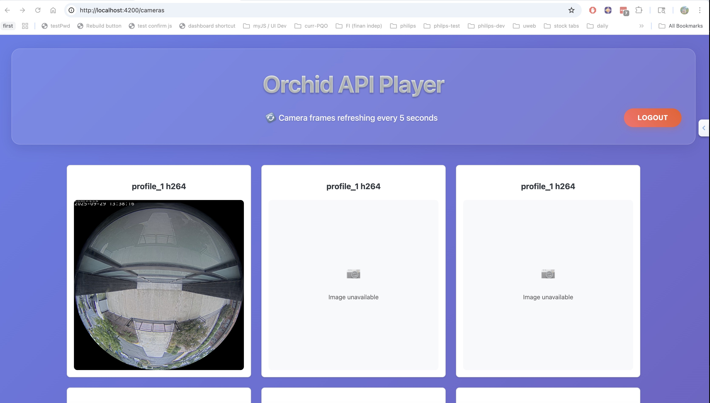
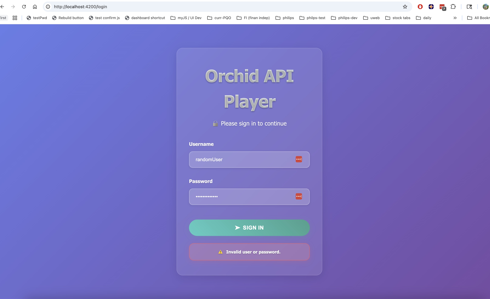

# Orchid API Player

A modern Angular application for live viewing camera feeds through the Orchid API. This application provides a secure interface for authentication and real-time camera grid visualization.


## Features

- 🔐 **Secure Authentication** - Login system with credential validation
- 📹 **Camera Grid View** - Real-time display of multiple camera feeds
- 🔄 **Auto-refresh** - Automatic updates of camera streams
- 📱 **Responsive Design** - Works across different screen sizes
- ⚡ **Modern Angular** - Built with Angular 20, standalone components and complete zoneless change detection (No zone.js)
- 🧪 **Comprehensive Testing** - Jest-based unit testing with 100% coverage



## Tech Stack

- **Framework**: Angular 20.3.0
- **Language**: TypeScript 5.9
- **Testing**: Jest 29.7.0
- **Build Tool**: Angular CLI 20.3.3
- **Styling**: SCSS
- **API**: Orchid Camera Management System

## Getting Started

### Prerequisites

- Node.js (Latest LTS version recommended)
- npm or yarn package manager

### Installation

1. Clone the repository:
```bash
git clone <repository-url>
cd orchid-api-player
```

2. Install dependencies:
```bash
npm install
```

3. Start the development server:
```bash
npm start
```

4. Open your browser and navigate to `http://localhost:4200/`

## Available Scripts

| Command | Description |
|---------|-------------|
| `npm start` | Start development server on http://localhost:4200 |
| `npm run build` | Build the project for production |
| `npm run watch` | Build in watch mode for development |
| `npm test` | Run unit tests with Jest |
| `npm run test:watch` | Run tests in watch mode |
| `npm run test:coverage` | Generate test coverage reports |

## Project Structure

```
src/
├── app/
│   ├── auth/                  # Authentication feature module
│   │   ├── login/             # Login component
│   │   ├── services/          # Auth services
│   │   └── auth.guard.ts      # Route guard
│   ├── cameras/               # Camera management feature module
│   │   ├── components/        # Camera-related components
│   │   │   ├── camera-grid/   # Main camera grid view
│   │   │   ├── camera-spinner/# Camera module spinner component reused at 2 places
│   │   │   └── camera-frame/  # Camera frame wrapper
│   │   ├── models/            # Data models
│   │   └── services/          # Camera services
│   ├── app.routes.ts          # Application routing
│   └── app.config.ts          # App configuration
└── scss/                      # Global styles in scss using mixins and variables
```

## Key Features

### Authentication System
- Secure login with credential validation and error handling
- Route protection using Angular guards
- Session management

### Camera Management
- Camera feed refreshing every 5 seconds
- Grid layout for multiple cameras
- Loading states and error handling

## Development

### Code Style
This project follows Modern Angular and TypeScript best practices:
- Standalone components (no NgModules) and zoneless design
- Signals for state management
- Modern control flow (`@if`, `@for`, `@switch`)
- Container and Presentation Components

### Testing
Tests are written using Jest and can be found alongside their respective components:
```bash
# Run all tests
npm test

# Run tests with coverage
npm run test:coverage

# Run tests in watch mode during development
npm run test:watch
```

#### Latest Test coverage report


### Building for Production
```bash
npm run build
```
The build artifacts will be stored in the `dist/` directory, optimized for production deployment.

## API Integration

The application integrates with the Orchid Camera Management System API:
- Base URL: `https://orchid.ipconfigure.com`
- Authentication endpoints for user login
- Camera stream endpoints for real-time feeds

## Screenshots

| Feature | Screenshot |
|---------|------------|
| Login Screen |  |
| Invalid Credentials |  |
| Camera Grid Loading |  |
| Camera Grid Active |  |


---

Built with ❤️ using Angular and TypeScript
